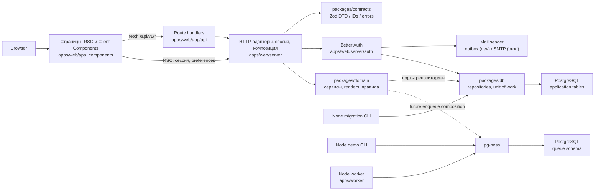

# LifeOS: система и границы

Сейчас реализованы технический Foundation (Stage 1) и ядро Stage 2: аккаунты Better Auth с закрытой регистрацией
([ADR-005](../adr/005-auth.md)), actor/ownership и timezone/locale ([ADR-006](../adr/006-actor-ownership.md)),
кодовый реестр шести сфер, ручные цели и измерения с транзакционным аудитом и квитанциями повторов
([ADR-007](../adr/007-goals.md)–[ADR-010](../adr/010-goals-api-progress.md)), Dashboard и журнал действий, пример
по выбору пользователя и мастер начальной настройки ([ADR-012](../adr/012-onboarding.md)). Специализированных модулей
Languages/Finance/Work/Projects/Skills/Health, Telegram и AI пока нет. Ниже — общая схема, затем по задачам: что каждая
добавила в архитектуру. Источник продуктового плана — [Master Plan v0.4](../reference/LifeOS_Master_Plan_v0.4.md);
его формулировки здесь не меняются.

## Процессы и поток данных

```mermaid
flowchart LR
  browser["Browser"] --> pages["Страницы: RSC и Client Components<br/>apps/web/app, components"]
  server["HTTP-адаптеры, сессия, композиция<br/>apps/web/server"]
  pages -- "fetch /api/v1/*" --> api["Route handlers<br/>apps/web/app/api"]
  pages -- "RSC: сессия, preferences" --> server
  api --> server
  server --> contracts["packages/contracts<br/>Zod DTO / IDs / errors"]
  server --> auth["Better Auth<br/>apps/web/server/auth"]
  auth --> mail["Mail sender<br/>outbox (dev) / SMTP (prod)"]
  server --> domain["packages/domain<br/>сервисы, readers, правила"]
  domain -- "порты репозиториев" --> db["packages/db<br/>repositories, unit of work"]
  auth --> db
  db --> appdb["PostgreSQL<br/>application tables"]
  cli["Node migration CLI"] --> db
  producer["Node demo CLI"] --> queue["pg-boss"]
  worker["Node worker<br/>apps/worker"] --> queue
  queue --> pg["PostgreSQL<br/>queue schema"]
  domain -. "future enqueue composition" .-> queue
```

Сплошные связи исполняются сейчас. Пунктир — будущая постановка фоновых задач из use cases; HTTP producer
пока нет. Domain не импортирует `packages/db`: он объявляет порты репозиториев, `packages/db` их реализует,
а `apps/web/server/core.ts` соединяет одно с другим. Обе части PostgreSQL находятся в одной application DB;
локальная test DB — отдельный instance. HTTP health не выполняет SQL и не проверяет доступность очереди.

Web, worker и producer CLI — отдельные Node процессы. `pnpm dev` запускает
только Web и build его dependencies; worker запускается отдельно через
`pnpm worker:dev` / `pnpm worker:start`. Worker не стартует из route handler,
React render или instrumentation. Доменная логика не должна зависеть от
жизненного цикла HTTP-запроса.

## Пакеты и разрешённые зависимости

| Путь | Текущая роль | Граница |
|---|---|---|
| `apps/web` | React UI, Next routes/layouts; HTTP-адаптеры `server/*.ts` (`apiRoute`, error mapper, session guards); композиция сервисов `server/core.ts`; Better Auth, mail transports, auth pages | Transport/auth adapters; бизнес-правила остаются в пакетах |
| `apps/worker` | PgBoss lifecycle, demo handler, producer CLI, безопасные технические логи | Не импортирует Web; будущие application/domain functions подключаются через пакеты |
| `packages/contracts` | Zod schemas и inferred DTO: health envelope, IDs, ошибки, цели, измерения, журнал, Dashboard, пример, начальная настройка, demo payload | Нет зависимости от apps, React, Next или env; можно использовать в browser |
| `packages/config` | Strict tsconfig, ESLint config; отдельный Node export `./env` | Tooling exports не читают env; runtime parser вызывается явно |
| `packages/db` | Drizzle schema (Better Auth, цели, измерения, события, квитанции, начальная настройка, техническая fixture), actor-scoped repositories (`src/repositories`) и unit of work (`src/*-unit-of-work.ts`), pg client factory; migrator — отдельный entry `@lifeos/db/migrations` | Персональные записи фильтруются по владельцу (`ownership.ts`); module import не открывает соединение |
| `packages/domain` | Framework-independent правила и сервисы: закрытая регистрация, actor/ownership, реестр сфер, цели, измерения, прогресс, Dashboard, журнал, пример, начальная настройка; порты репозиториев | Нет Next/React/apps imports, Node API в исходниках (build без Node types), SQL и обхода repositories; зависит только от contracts |

Web и worker объявляют зависимости на DB/config/contracts в manifests.
Web обращается к DB только через repositories и unit of work, которые собирает `server/core.ts`. Production worker
обращается к очереди через pg-boss, а не через application Drizzle client;
общая транзакция DB и очереди продемонстрирована только integration fixture.
Пакеты не зависят от приложений; приложения не экспортируются как библиотеки.

Application layer — правило размещения будущих use cases внутри packages,
не отдельный уже существующий `packages/application` или backend service.
Языковой учитель не определяет архитектуру всей платформы. Новые Redis,
NestJS/Prisma, микросервисы или другой стек требуют отдельного согласованного ADR.

## Web, маршруты и состояния

| URL | Файл | Текущее поведение |
|---|---|---|
| `/` | `apps/web/app/(web)/page.tsx` | Обзор шести сфер из кодового реестра, без персональных чисел/процентов |
| `/domains/<key>` (ровно 6 ключей) | `apps/web/app/(web)/domains/[domainKey]/page.tsx` | Гостю — описание сферы; после входа — цели сферы и последние действия в ней (LFS-213). Неизвестный ключ — 404 (`proxy.ts`) |
| `/dashboard` | `apps/web/app/(web)/dashboard` | «Мой кабинет»: шесть сфер, сроки, последние действия (LFS-204, 213), сферы в фокусе (LFS-219) |
| `/goals`, `/goals/[id]` | `apps/web/app/(web)/goals/(browse)` | Список в `layout.tsx`, панель цели в страницах (LFS-208, 213) |
| `/goals/new` | `apps/web/app/(web)/goals/new`, `(web)/@modal/(.)goals/new` | Прямой заход — страница, переход внутри приложения — диалог (LFS-212) |
| `/settings` | `apps/web/app/(web)/settings` | Профиль, выход, timezone/locale (LFS-202, 213) |
| `/onboarding` | `apps/web/app/(onboarding)/onboarding` | Мастер начальной настройки (LFS-219) |
| `/auth/sign-in`, `/auth/sign-up`, `/auth/forgot-password`, `/auth/reset-password` | `apps/web/app/(auth)/auth/*` | Формы через Better Auth client; валидация `@lifeos/contracts` |
| `/telegram` | `apps/web/app/(telegram)/telegram/page.tsx` | Компактная заглушка Mini App, без Telegram SDK/linking |
| `/api/health` | `apps/web/app/api/health/route.ts` | Dynamic JSON envelope, текущий ISO timestamp, no-store, request/correlation ID |
| `/api/auth/*` | `apps/web/app/api/auth/[...all]/route.ts` | Better Auth: sign-up/sign-in/sign-out/session/password reset |
| `/api/v1/*` | `apps/web/app/api/v1/**/route.ts` → `apps/web/server/*.ts` | me, preferences, goals, goal-measurements, dashboard, activity, starter-pack, onboarding; 401 без сессии. Список методов — [README](../../README.md#web), DTO — [contracts](../api/contracts.md) |
| Неизвестный URL | `apps/web/app/not-found.tsx` | HTML 404 |

Защищённые страницы (`/dashboard`, `/goals*`, `/settings`, `/onboarding`, личная часть `/domains/*`) проверяют
сессию на сервере (`requirePageUser()`/`requirePageSession()`/`getPageSession()`), а оптимистичный `proxy.ts`
отправляет гостя на вход (307).

Единственный root layout — `app/layout.tsx`; route groups `(web)`, `(auth)`, `(onboarding)` и `(telegram)`
выбирают внутренние layouts, но не добавляют URL segments. Явная папка `telegram`
создаёт реальный путь `/telegram`; будущие Mini App routes должны быть
`/telegram/*`. Путь `/(telegram)/telegram` не является маршрутом.
Есть loading/error boundaries, skip-link, focus styles и responsive CSS.
Визуальную/keyboard/mobile приёмку следует отличать от HTTP smoke.

LFS-203: `DOMAIN_KEYS` и Zod `domainKeySchema` находятся в contracts;
domain строит по ним `LIFE_DOMAINS` с локализуемыми названиями/описаниями,
статусом, capabilities и стабильными URL. `available` относится к общей
модели ручных целей, `specializedAvailable` во всём Stage 2 — false.
Web отдельно сопоставляет ключам иконки/цвета. В LFS-203 страницы сфер не читали БД;
с LFS-213 после входа они показывают цели и журнал своей сферы. Дополнительной
страницы-обзора `/domains`, таблицы `domains` или плагинной системы нет.

## Env, сборка и imports

`apps/web/scripts/run-next.ts` в Web dev/start проверяет env до загрузки Next CLI.
Дополнительная server-only проверка находится в `instrumentation.ts` и
пропускает build phase. Это важно для Next 16.4.5: одно только instrumentation
может завершиться после сообщения Ready. Worker/producer проверяют env до
создания runtime; DB CLI — до pool. Root `.env` загружается средствами Node,
process env имеет приоритет. Конфиги и ошибки описаны в [API contracts](../api/contracts.md).

`pnpm build` создаёт Web `.next`, worker `dist` и ESM/declarations общих пакетов.
Tooling config экспортируется напрямую. Native Node 24 исполняет TypeScript
CLI/dev scripts; source imports не должны создавать pools или проверять
секреты на стадии сборки. Strict TypeScript включён во всех workspace;
локальный skipLibCheck у Next/Drizzle consumers описан в [ADR-001](../adr/001-stack.md).

Secrets не передаются в client props, NEXT_PUBLIC_* или next.config.env.
HTTP logs содержат allowlisted technical fields; SQL, raw payload и upstream
exceptions наружу не передаются. Actor определяется только серверной
cookie-сессией Better Auth (`requirePageSession`/`requireApiActor` → branded
`Actor` из `@lifeos/domain`). Repositories фильтруют персональные записи по
`user_id = actor.userId` (`ownedBy`), services отвечают `NotFoundError` на чужое
и отсутствующее одинаково (HTTP 404) — [ADR-006](../adr/006-actor-ownership.md).
Provenance персональных данных вводится вместе с goals/measurements (LFS-205+).

LFS-205: contracts содержит goal DTO/decimal правила; domain — `GoalsService`
и repository port; DB — SQL schema и actor-scoped repository, пригодный также
для Drizzle transaction. DB имеет runtime dependency на contracts (те же
ключи/лимиты), dependency на domain используется только для типов. Циклов
нет. Схема и политика — [ADR-007](../adr/007-goals.md); HTTP/API/UI целей,
UI вводится отдельно в LFS-208; API и прогресс подключены в LFS-207.

LFS-210: goal service использует `GoalsUnitOfWork`. В одной Drizzle transaction
сохраняются goal mutation, append-only activity event и idempotency receipt.
DB берёт transaction-scoped advisory key lock и SELECT FOR UPDATE родительской
цели. Domain формирует whitelisted before/after; DB обеспечивает atomicity,
FK ownership и durable replay. Никакой очереди, event sourcing, projection
или нового runtime. Source web/manual назначается сервером; Telegram/import/
AI остаются зарезервированы. [ADR-008](../adr/008-transactional-audit.md).

LFS-206: measurement service и DB UOW используют ту же transactional границу.
Parent goal блокируется перед child; actor/parent unit защищены compound FK.
Точные измерения, current по measured_at/created_at/id и минимальный аудит
не требуют projection/worker. Общий receipt расширен target/resource полями
для replay удаления. Без измерений current=null; проценты в LFS-206 ещё не считались, их добавил LFS-207.
[ADR-009](../adr/009-goal-measurements.md).

LFS-207: восемь HTTP операций `/api/v1/goals*` и
`/api/v1/goal-measurements/:id` используют существующие auth/envelope и
write UOW. `GoalsReader` через DB repository читает repeatable-read snapshot
и передаёт данные чистому BigInt progress calculator в domain. Это обычные
SQL read queries, без projection/очереди. Detail и list содержат methodology,
manual self-report provenance, count и последнее время изменения. History
и goal list имеют bounded cursor pagination. [ADR-010](../adr/010-goals-api-progress.md).

LFS-208: RSC pages `/goals`, `/goals/new`, `/goals/[id]` проверяют сессию и
передают только user preferences/public domain choices в Client Components.
Все goal reads/writes идут через API LFS-207. Client formatting не вычисляет
progress; exact decimal и account-timezone представление отделены от domain.
Mutation state удерживает один key/body при неопределённом ответе, не создаёт
browser persistence личных payload. Новый backend/runtime/DDL не вводится.

LFS-204: `createDashboardReader` (domain) строит Dashboard из реестра
`LIFE_DOMAINS`, общего `goalDetailsFromRecord` (тот же GoalDetails, что у
GoalsReader) и нормализованных `activity_events`; чужие события скрываются,
чужая цель от адаптера — NOT_FOUND. DB `createDashboardReadRepository` читает
один repeatable-read snapshot: counts по сфере/статусу, до 5 новейших активных
целей на сферу (`row_number() over (partition by domain_key)`), ближайшие сроки,
общий трёхзапросный summary целей и события с JOIN на цель владельца. Число
запросов фиксировано и не зависит от числа целей. `/dashboard` — RSC с
проверкой сессии и Client Component, читающий `GET /api/v1/dashboard`
(loading/error/retry/empty). Миграций, projection и очереди нет.

LFS-212: только presentation-слой Web. Общий UI-kit в `apps/web/components/ui`
(PageHeader, SectionCard, StatCard, SourceLabel, ProgressBar, DomainIcon,
StatusChip, SegmentedChoice) по [UI_GUIDELINES](../UI_GUIDELINES.md); цвета только
токенами `globals.css`, что проверяет ESLint-правило `lifeos-ui/no-color-literals`.
«Новая цель» — parallel slot `app/(web)/@modal` с intercepting route `(.)goals/new`:
та же RSC-проверка сессии и тот же POST `/api/v1/goals`, но форма показывается
диалогом поверх текущей страницы; прямой заход на `/goals/new` рендерит страницу.
API, контракты, схема БД и runtime не менялись.

LFS-213: журнал действий `GET /api/v1/activity` — contracts `activity.ts`, DB `createActivityReadRepository`
(один owner-scoped запрос на существующих индексах), domain `createActivityReader` с общей для Dashboard
нормализацией записей. `/goals` разделён на route group `goals/(browse)`: список в layout, панель цели в страницах.
Неизвестная сфера отвечает 404 через rewrite в `proxy.ts`. Миграций нет.

LFS-216: `GoalsService.deleteGoal` и `DELETE /api/v1/goals/:goalId` удаляют активную или архивную цель в одной
транзакции; FK CASCADE убирает её измерения, события и прежние квитанции. Повтор с тем же ключом отвечает по
`goal_deletion_receipts` (миграция 0006). Проверка Origin всех записей сравнивает его с `BETTER_AUTH_URL`.
[ADR-007, дополнение LFS-216](../adr/007-goals.md#дополнение-lfs-216--2026-11-18).

LFS-217: `PATCH` цели принимает определение целиком (единица, старт, цель, направление) и только до первого
измерения, иначе `CONFLICT`; проверка идёт под той же блокировкой строки цели. Миграций нет.
[ADR-007, дополнение LFS-217](../adr/007-goals.md#дополнение-lfs-217--2026-11-19).

LFS-218: пример по выбору пользователя — `createStarterPackService` (`apply`, `remove`),
`POST`/`DELETE /api/v1/starter-pack`. `Goal.origin` (`manual` | `starter` | `onboarding`) ставит только сервер;
источник измерений `example`, флаг `example` в журнале и Dashboard, квитанции `starter_pack_receipts`
(миграция 0007). Автоматически пример не получает ни один аккаунт. Дополнения LFS-218 к ADR-007, 008, 009.

LFS-219: мастер начальной настройки. Каталог вопросов v1 — данные в domain (`ONBOARDING_QUESTIONS`; для браузера
отдельный вход `@lifeos/domain/onboarding` без сервисов). `createOnboardingService` (`get`, `saveDraft`, `complete`)
и `createOnboardingUnitOfWork`: отмеченные цели (`origin = onboarding`), профиль, состояние и квитанция в одной
транзакции. Таблицы `onboarding_state`, `onboarding_receipts`, колонки `user.focus_domains` и `user.checkin_rhythm`
(миграция 0008). HTTP `GET`/`PUT /api/v1/onboarding`, `POST /api/v1/onboarding/complete`; страница `/onboarding`
в route group `(onboarding)`, защищена в `proxy.ts`. [ADR-012](../adr/012-onboarding.md).

## Проверка и handoff

Полная цепочка — `pnpm verify`: frozen install, lint/types, unit, test
migrations, PostgreSQL integration, builds и build smoke. CI и ограничения:
[CI](../CI.md). Модель данных: [database schema](database-schema.md).
Очередь/транзакции: [worker](worker.md). Процесс работы:
[development workflow](../DEVELOPMENT_WORKFLOW.md).
Текущий статус и следующая задача — [docs/tasks/README.md](../tasks/README.md). Приёмка и незакрытые пункты —
[Stage 1](../tasks/STAGE-01-ACCEPTANCE.md), [Stage 2](../tasks/STAGE-02-ACCEPTANCE.md).
